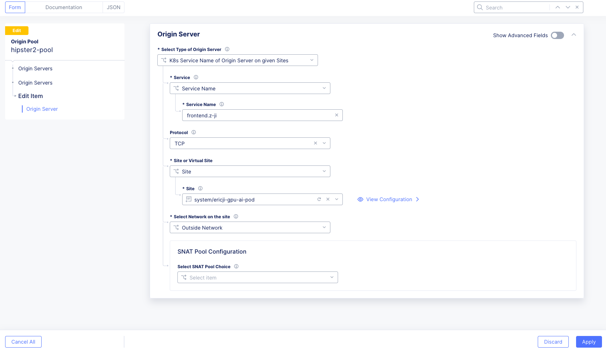
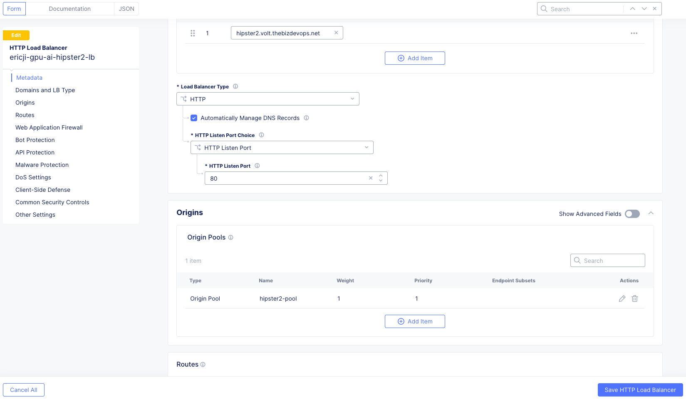
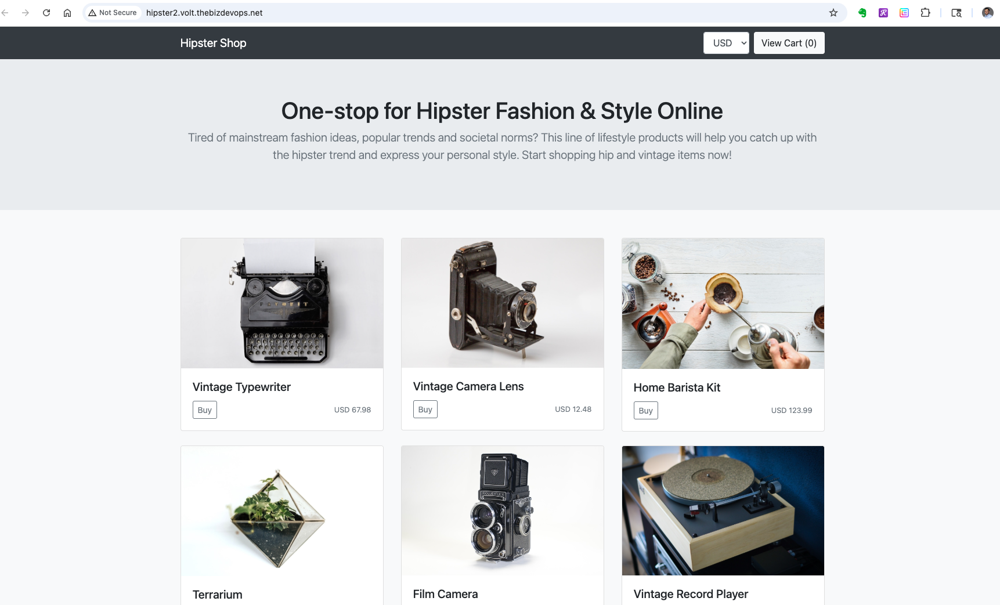

# 🌐 F5XC Deployment – My Deployment

## 🎯 Objective
The objective is to integrate **F5 Distributed Cloud Mesh (Mesh)** capabilities with a **single Red Hat OpenShift (OCP)** cluster by deploying the **F5XC site as pods** directly within the cluster.  
This deployment method automatically discovers services running in the OCP cluster by querying the **kube-API** for services.

---

## 🧩 Prerequisites
This deployment supports Mesh functionalities only and was performed on the following environment:

| **Requirement** | **Observed Configuration ("my deployment")** | **Source** |
|------------------|-----------------------------------------------|-------------|
| **OCP Node** | `api.gpu-ai.bd.f5.com` *(Control-plane, master, worker, worker-hp roles)* |  |
| **Kubernetes Version** | `v1.31.6` *(OCP version 4.7 is supported)* |  |
| **Minimum Resources** | 4 vCPUs and 8 GB memory per node (minimum) |  |
| **StorageClass (Dynamic PVC)** | `lvms-vg1 (default)` *(default indicates dynamic PVC enabled)* |  |

---

##  Step 1: OCP Environment Configuration
This step ensures the OCP environment meets the **kernel and storage requirements** for the F5XC pod deployment.

### 1.1  Verify OpenShift Cluster Readiness
Check the cluster state:
```bash
oc get nodes

NAME                STATUS   ROLES                                    AGE   VERSION
api.gpu-ai.bd.f5.com   Ready    control-plane,master,worker,worker-hp   221d  v1.31.6
```
Check for any failed pods:
```bash
oc get pod -A | egrep -vi 'Running|Completed'
```
> 🟢 *No pending or failed pods were observed at this stage.*

---

### 1.2  Enable Kernel HugePages
HugePages must be configured when deploying Mesh as OCP pods.

**Steps:**
1. **Label the Node:**  
   Assign custom role `worker-hp` to target node.

```bash
╰─ oc label node api.gpu-ai.bd.f5.com node-role.kubernetes.io/worker-hp=
node/api.gpu-ai.bd.f5.com labeled
╭─    ~/volterra                                                                                                                                                        ✔  base   f5-demo/api-gpu-ai-bd-f5-com:6443/kube:admin/f5-demo ⎈
╰─ oc get node
NAME                   STATUS   ROLES                                   AGE    VERSION
api.gpu-ai.bd.f5.com   Ready    control-plane,master,worker,worker-hp   221d   v1.31.6
```

2. **Apply Tuned and MachineConfigPool (MCP):**
   - `hugepages-tuned-boottime.yaml`
```bash 
apiVersion: tuned.openshift.io/v1
kind: Tuned
metadata:
  name: hugepages
  namespace: openshift-cluster-node-tuning-operator
spec:
  profile:
  - data: |
      [main]
      summary=Boot time configuration for hugepages
      include=openshift-node
      [bootloader]
      cmdline_openshift_node_hugepages=hugepagesz=2M hugepages=1792
    name: openshift-node-hugepages

  recommend:
  - machineConfigLabels:
      machineconfiguration.openshift.io/role: "worker-hp"
    priority: 30
    profile: openshift-node-hugepages
```

   - `hugepages-mcp.yaml`
```bash 
apiVersion: machineconfiguration.openshift.io/v1
kind: MachineConfigPool
metadata:
  name: worker-hp
  labels:
    worker-hp: ""
spec:
  machineConfigSelector:
    matchExpressions:
      - {key: machineconfiguration.openshift.io/role, operator: In, values: [worker,worker-hp]}
  nodeSelector:
    matchLabels:
      node-role.kubernetes.io/worker-hp: ""
```

3. **Verify:** Confirm HugePages allocation on labeled node.

---

### 1.3  Validate StorageClass and PVC Functionality
Ensure a StorageClass with **Dynamic Persistent Volume Provisioner** is available:
```bash
oc get sc
```
```
NAME              PROVISIONER                  RECLAIMPOLICY   VOLUMEBINDINGMODE      ALLOWVOLUMEEXPANSION   AGE
localblock-sc     kubernetes.io/no-provisioner Delete          WaitForFirstConsumer   false                  221d
lvms-vg1 (default) topolvm.io                  Delete          WaitForFirstConsumer   true                   221d
```
> ✅ The presence of `(default)` on `lvms-vg1` confirms dynamic PVC provisioning is enabled.

---

##  Step 2: Deploy Cloud Mesh Pod
This step deploys the F5XC site using the **CE on K8S** manifest file.

### 2.1  Download Manifest
Download from GitLab:  
🔗 [volterra-ce GitLab Repository](https://gitlab.com/volterra.io/volterra-ce/-/raw/master/k8s/ce_k8s.yml)

---

### 2.2  Update Manifest for Environment
For this single-site deployment, the manifest `ce_ocp_gpu-ai.yml` was customized.  
The standard manifest includes optional **NodePort definitions** for multi-cluster configurations, which can be safely **commented out or removed**.

```bash
╰─ diff ce_k8s\ \(2\).yml ce_ocp_gpu-ai.yml
144c144
<     ClusterName: <cluster name>
---
>     ClusterName: ericji-gpu-ai-pod
149c149
<     Latitude: <latitude>
---
>     Latitude: 44
151c151
<     Longitude: <longitude>
---
>     Longitude: -122
157c157
<     Token: <token>
---
>     Token: xxxx
```

📸 *(Insert screenshot of F5XC Console showing Site Token generation here.)*

---

### 2.3  Apply Deployment
```bash
oc create -f ce_ocp_gpu-ai.yml
```
**Example Output:**
```
namespace/ves-system created
serviceaccount/volterra-sa created
role.rbac.authorization.k8s.io/volterra-admin-role created
rolebinding.rbac.authorization.k8s.io/volterra-admin-role-binding created
daemonset.apps/volterra-ce-init created
serviceaccount/vpm-sa created
role.rbac.authorization.k8s.io/vpm-role created
clusterrole.rbac.authorization.k8s.io/vpm-cluster-role created
rolebinding.rbac.authorization.k8s.io/vpm-role-binding created
clusterrolebinding.rbac.authorization.k8s.io/vpm-sa created
clusterrolebinding.rbac.authorization.k8s.io/ver created
configmap/vpm-cfg created
statefulset.apps/vp-manager created
service/vpm created
```

####  PVC Verification
```bash
oc -n ves-system get pvc
```
```
NAME                     STATUS   VOLUME                                     CAPACITY   ACCESS MODES   STORAGECLASS   AGE
data-vp-manager-0        Bound    pvc-48a97ea0-deaa-425d-9349-a92525865c1b   1Gi        RWO            lvms-vg1       40s
etcvpm-vp-manager-0      Bound    pvc-8f5d12cd-d648-4c50-ac3f-a356f69a3694   1Gi        RWO            lvms-vg1       40s
varvpm-vp-manager-0      Bound    pvc-7f89642f-c304-4ee3-b797-042304c58eef   1Gi        RWO            lvms-vg1       40s
```

---

### 2.4  Approve Registration on F5XC Console

Log into Console to accept the site registrations.


After deployment, monitor F5XC pods:
```bash
oc -n ves-system get pod -o wide
```
**Example Output (Initial CrashLoopBackOff):**
```
NAME                          READY   STATUS             RESTARTS   AGE   IP             NODE
etcd-0                        2/2     Running            0          3m    10.128.1.254   api.gpu-ai.bd.f5.com
prometheus-5c79db4978-tx7st   4/5     CrashLoopBackOff   4          3m    10.128.0.5     api.gpu-ai.bd.f5.com
ver-0                         0/17    PodInitializing    0          3m    10.128.0.10    api.gpu-ai.bd.f5.com
volterra-ce-init-rsj65        1/1     Running            0          6m    192.170.3.130  api.gpu-ai.bd.f5.com
vp-manager-0                  1/1     Running            2          5m    10.128.1.252   api.gpu-ai.bd.f5.com
```

#### ⚠️ Troubleshooting: Prometheus HostPort Issue
Prometheus was configured with **hostPort bindings**, causing `CrashLoopBackOff`.

Inspect deployment:
```bash
oc get deployment prometheus -o yaml | egrep -n 'hostNetwork|hostPort|containerPort|readinessProbe|livenessProbe'
```
**Offending Ports:**
```
- containerPort: 65210
  hostPort: 65210
- containerPort: 65211
  hostPort: 65211
- containerPort: 65220
  hostPort: 65220
- containerPort: 65221
  hostPort: 65221
```

**Remediation:** Remove the `hostPort` lines.
```bash
oc -n ves-system edit deploy/prometheus
```
**Resulting Configuration:**
```
- containerPort: 65210
  protocol: TCP
- containerPort: 65211
  protocol: TCP
- containerPort: 65220
  protocol: TCP
- containerPort: 65221
  protocol: TCP
```

📸 *(Insert screenshot of F5XC Console showing Pending Registration approval here.)*

---

### ✅ Final Running Status
```bash
oc get pod -n ves-system -o wide

NAME                          READY   STATUS    RESTARTS   AGE   IP             NODE
etcd-0                        2/2     Running   0          45m   10.128.1.214   api.gpu-ai.bd.f5.com
prometheus-57df68c9dd-qnbtn   5/5     Running   0          72s   10.128.1.237   api.gpu-ai.bd.f5.com
ver-0                         17/17   Running   0          45m   10.128.1.216   api.gpu-ai.bd.f5.com
volterra-ce-init-jm8tb        1/1     Running   0          48m   192.170.3.130  api.gpu-ai.bd.f5.com
vp-manager-0                  1/1     Running   3          47m   10.128.1.212   api.gpu-ai.bd.f5.com
```

---

##  Step 3: Deploy Application on OpenShift
With the F5XC site operational, deploy the **Hipster Shop** application.

### 3.1 🏗️ Install Apps
1. **Create Namespace**
2. **Deploy Application**
```bash
╰─ oc create hipster.yaml -n z-ji

deployment.apps/emailservice created
service/emailservice created
deployment.apps/paymentservice created
service/paymentservice created
deployment.apps/productcatalogservice created
service/productcatalogservice created
deployment.apps/cartservice created
service/cartservice created
deployment.apps/currencyservice created
service/currencyservice created
deployment.apps/shippingservice created
service/shippingservice created
deployment.apps/recommendationservice created
service/recommendationservice created
deployment.apps/checkoutservice created
service/checkoutservice created
deployment.apps/frontend created
service/frontend created
deployment.apps/redis-cart created
service/redis-cart created
deployment.apps/loadgenerator created
```

3. **Note:** Since Mesh runs inside OCP, the `frontend` service can use type `ClusterIP`.
4. **Verify App Status:** Ensure all pods reach **Running** state.
```bash
╰─ oc get pod
NAME                                     READY   STATUS    RESTARTS      AGE
cartservice-96976f754-lpt56              1/1     Running   1 (31s ago)   53s
checkoutservice-7958b7666c-6wdw8         1/1     Running   0             53s
currencyservice-5d54ccfd8c-9zxkl         1/1     Running   0             53s
emailservice-6ff8ff9c47-bks7p            1/1     Running   0             53s
frontend-6f887d4ddf-wcvlp                1/1     Running   0             53s
loadgenerator-56bb66b7b7-d4jqb           1/1     Running   2 (18s ago)   53s
paymentservice-df9c45f97-lg6td           1/1     Running   0             53s
productcatalogservice-79679f9cc5-kqqq7   1/1     Running   0             53s
recommendationservice-74fbc8f879-4psw4   1/1     Running   0             53s
redis-cart-79589699d7-9nlpq              1/1     Running   0             53s
shippingservice-7f6d6cc4d5-9ggf2         1/1     Running   0             53s
```

---

##  Step 4: Advertise Services
Since the F5XC site runs as pods, **service discovery is automatic** via the kube-API.  
Services are advertised using **Origin Pools** and **HTTP Load Balancers** in the F5XC Console.

### 4.1  Create Origin Pool
1. In F5XC Console → **Multi-Cloud App Connect**
2. Select your namespace *(e.g., `z-ji`)*
3. Navigate to **Manage → Load Balancers → Origin Pools**
4. Click **Add Origin Pool**
5. Select **K8s Service Name of Origin Server on given Sites**
6. Enter `<servicename>.<namespace>` (e.g., `frontend.z-ji`)
7. Choose deployed Mesh site
8. Select **Outside Network**
9. Click **Save and Exit**\




---

### 4.2  Create HTTP Load Balancer
1. Go to **Manage → Load Balancers → HTTP Load Balancers**
2. Provide a descriptive name in **Metadata**
3. Under **Basic Configuration**, enter the domain name
4. Under **Default Origin Servers**, reference the Origin Pool from Step 4.1
5. Click **Save and Exit**



---

### 4.3 🔍 Verify Application Accessibility
After the load balancer deployment:
- ✅ Application pods appear as origin servers under the **Origin Servers** tab  
- 🌍 Application is accessible via the configured domain name




📸 *(Insert screenshot of F5XC Console showing Origin Server status here.)*
