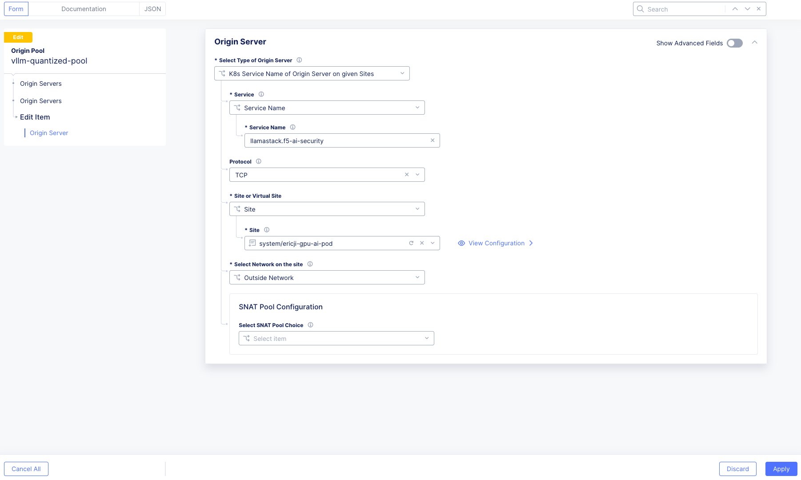
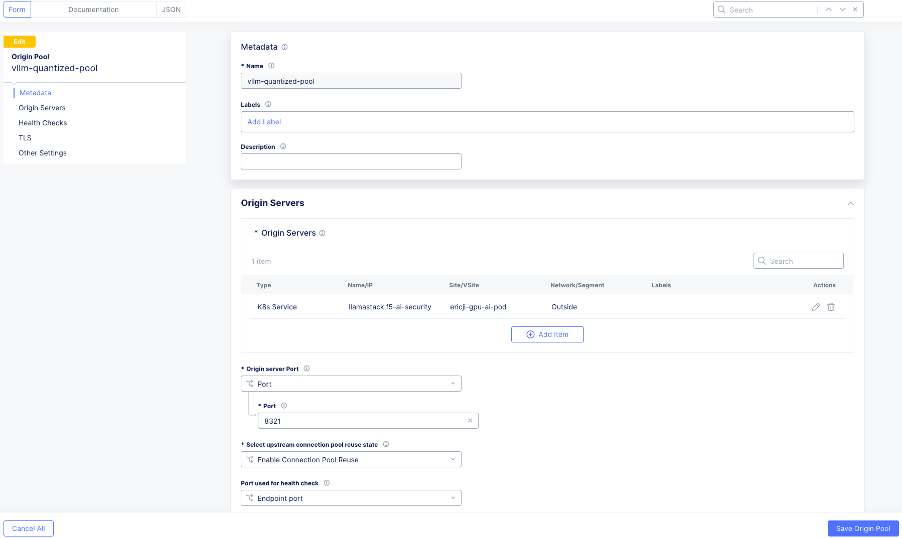

# Securing AI Model Inference Endpoints with F5 Distributed Cloud WAAP

This lab guides you through configuring **F5 Distributed Cloud (XC) Web Application and API Protection (WAAP)** features to secure a Generative AI model inference endpoint (represented by `llamastack.f5-ai-security` running in a vK8s environment).

**Objective:** Secure the inference endpoint from prompt injection, shadow APIs, sensitive data leakage, and automated attacks.

---

## 🧩 Prerequisites

- Operational **F5 Distributed Cloud Account** and Console access  
- **kubectl** installed locally

---

## Step 0: Initial Load Balancer Configuration and Inference Endpoint Verification

This step ensures the model serving application is exposed via an F5 Distributed Cloud HTTP Load Balancer (LB).

### Task 0.1: Verify llamastack Service Running in OpenShift

1. **Check Service Status**  
   - Ensure that the `llamastack` service is deployed and running properly within your OpenShift project or namespace.  
   - Run the following commands to verify that the pods, service, and endpoints are active:

```bash
oc get pods -n <your-namespace> | grep llama
oc get svc -n <your-namespace> | grep llama
oc get endpoints -n <your-namespace> | grep llama
```

Expected Output:
```
llamastack-f5-ai-security   ClusterIP   10.0.142.12   <none>   8080/TCP   2d
llamastack-f5-ai-security-7d9c7b9d9f   1/1     Running   0     2d
```

2. **Confirm Service Accessibility (Internal Test)**  
   - You can test the inference service directly from within the OpenShift cluster to confirm it’s responding before integrating with F5 Distributed Cloud:

```bash
oc run test-client --rm -i --tty --image=registry.access.redhat.com/ubi9/ubi-minimal -- curl -s http://llamastack-f5-ai-security.<your-namespace>.svc.cluster.local:8080/v1/openai/v1/models | jq
```

Expected JSON output should show available models such as `Llama-3.2-1B-Instruct-quantized.w8a8`.

### Task 0.2: Set up the HTTP Load Balancer

1. Navigate to **Multi-Cloud App Connect → HTTP Load Balancers**  
2. Click **Add HTTP Load Balancer**
   - **Name:** `ai-inference-lb`  
   - **Domain Name:** `vllm-quantized.volt.thebizdevops.net`
3. **Configure Origin Pool:**
   - Add Item → name the pool  
4. **Configure Origin Server:**
   - Type: *K8s Service Name of Origin Server on given Sites*  
   - Service Name: `llamastack.f5-ai-security`  
   - Virtual Site Type: `yourside`  (ex. `system/ericji-gpu-ai-pod` )
   - Network: `Outside Network`  




   - Port: `8321`



5. **Save LB:** Continue → Apply → Save and Exit. Record the generated **CNAME**.

### Verification of Inference Endpoint Access

```bash
curl -sS http://vllm-quantized.volt.thebizdevops.net//v1/openai/v1/models | jq
```
Expected Output:
```json
{
  "data": [
    {
      "id": "remote-llm/RedHatAI/Llama-3.2-1B-Instruct-quantized.w8a8",
      "object": "model",
      "created": 1762644418,
      "owned_by": "llama_stack"
    },
    {
      "id": "sentence-transformers/all-MiniLM-L6-v2",
      "object": "model",
      "created": 1762644418,
      "owned_by": "llama_stack"
    }
  ]
}
```

---

## 🧱 Use Case 1: Protecting Against Prompt Manipulation and Injection Attacks (WAF & MUD)

The Web Application Firewall (WAF) is deployed to block input manipulation (prompt injection) and conventional injection attacks (XSS, SQLi) targeting the inference endpoint. Malicious User Detection (MUD) provides behavioral analysis.

### Task 1.1: Enable and Configure WAF Policy

1. Edit LB → **Web App & API Protection → HTTP Load Balancers → Manage Configuration → Edit Configuration**  
2. In **Web Application Firewall**, enable **App Firewall** → click **Add Item**  
3. Configure:  
   - **Mode:** Blocking  
   - **Detection:** Custom  
   - **Signatures:** High, Medium, Low accuracy  
   - **Response:** Custom `403 Forbidden`  
   - (WAF automatically filters sensitive fields like `card` or `password` from logs.)  
4. Click **Save and Exit**

### Task 1.2: Traffic Generation and WAF Confirmation

1. Use the [Test Tool](https://test-tool.sr.f5-cloud-demo.com).  
   - Paste LB CNAME and **SEND ATTACKS** → vulnerable before WAF  
   - Inject prompt via `/v1/chat/completions` → attack passes
2. After enabling WAF → click **SEND ATTACKS** again  
   - All attacks should be blocked

📸 *[Insert Screenshot 2: Test Tool Confirmation of Blocked WAF Attacks]*

### Task 1.3: Review Security Analytics and MUD

1. Navigate to **Dashboards → Security Dashboard**  
2. Explore **Security Analytics → Attack details (e.g., Java injection)**  
3. Use **Add to Blocked Clients** to apply **MUD** (ML-based user blocking).

📸 *[Insert Screenshot 3: Security Analytics Dashboard Showing Blocked Event]*

---

## 🧾 Use Case 2: Enforcing API Specification, Sensitive Data Detection, and Preventing Shadow APIs

This use case enforces documented API access only and uses **API Discovery** for continuous visibility.

### Task 2.1: Upload API Specification

1. Go to **Swagger Files → Add Swagger File** → name it → upload OpenAPI spec → Save  
2. Go to **API Definition → Add API Definition** → select uploaded spec → Save

### Task 2.2: Apply API Protection and Deny Shadow APIs

1. Edit LB → enable **API Definition** and select your definition  
2. Under **Common Security Controls**, choose **Apply Specified Service Policies**  
3. Add Custom Rules:  
   - **Rule 1:** Deny traffic not matching `/v1/` (invert string matcher)  
   - **Rule 2:** Allow all others  
4. Save and Exit

*(Note: If “exhausted limits” error appears, request API schema limit increase via support.)*

### Task 2.3: Traffic Generation and API Confirmation

1. Access LLM docs endpoint → execute API calls and try undocumented paths  
2. Before policy: vulnerable; after policy: protected  
3. Review **API Discovery Dashboard** for detected endpoints and sensitive data

📸 *[Insert Screenshot 4: API Discovery Dashboard Highlighting Sensitive Data or Shadow APIs]*

---

## ⚙️ Use Case 3: Mitigating Automated Attack Traffic and Excessive Requests (Bot/DDoS/Rate Limiting)

This protects inference endpoints from resource exhaustion and denial of service.

### Task 3.1: Configure Bot Protection

1. Edit LB → **Bot Protection → Enable → Configure**  
2. Add App Endpoint:  
   - Methods: PUT, POST  
   - Path: `/api/v1/`  
   - Mitigation: Block (403)  
3. Save and Exit

### Task 3.2: Configure Rate Limiting and DDoS Protection

1. Enable **IP Reputation:** categories – Spam, DoS, Proxy, Tor, Botnets  
2. Configure **Rate Limiting:**  
   - Number: `10` requests  
   - Burst Multiplier: `5`  
3. Enable **DDoS Protection:**  
   - Add IP Source Rule → block `203.0.113.0/24`

### Task 3.3: Traffic Generation and Confirmation

1. Simulate bot traffic using Test Tool or `ab` load tests  
2. Before: traffic passes; after: blocked  
3. Review **Security Dashboard → Bot Defense & DDoS Tabs** for analytics

📸 *[Insert Screenshot 5: Bot Defense Dashboard Showing Blocked Traffic]*
